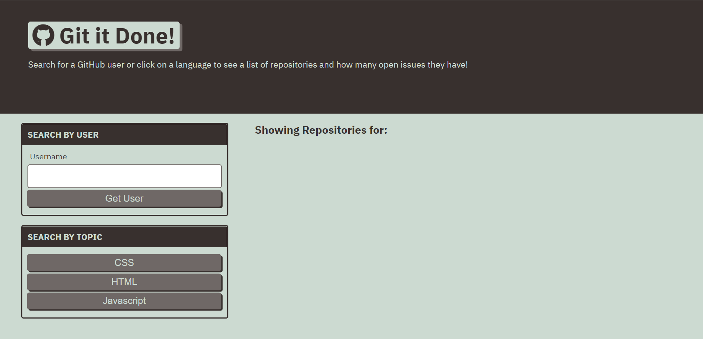
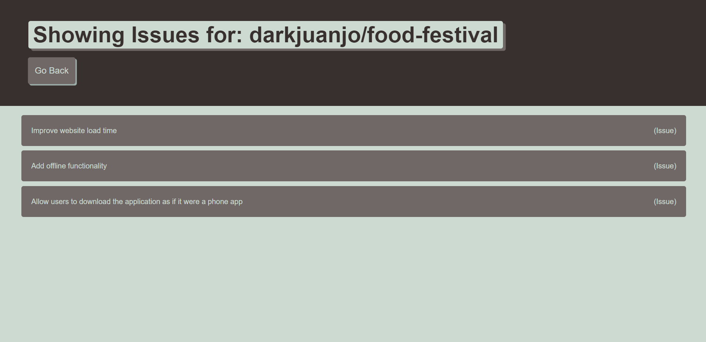

# git-it-done

 ### git-it-done Criteria:
        - [✔️] Use github API.
        - [✔️] Use API to search for repository by user or technology.
        - [✔️] Show if repo has open issues.
        - [✔️] Open repo in seperate page.

Please see link below for git-it-done accessible URL: 
        https://darkjuanjo.github.io/git-it-done/
        
**Below is the source code for the Weather-Dashboard in GitHub. Please note that code is in assets/js. **
        https://github.com/darkjuanjo/git-it-done

## See below for some screenshots

### Hompeage

### Single Repo
